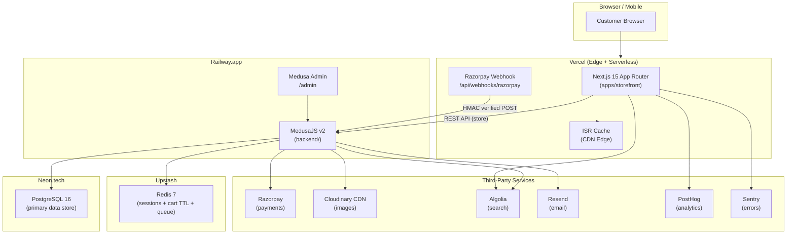
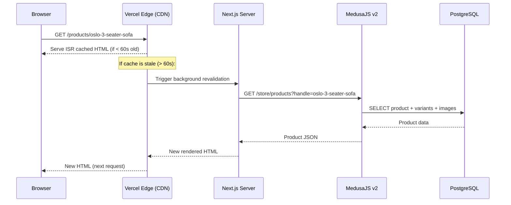
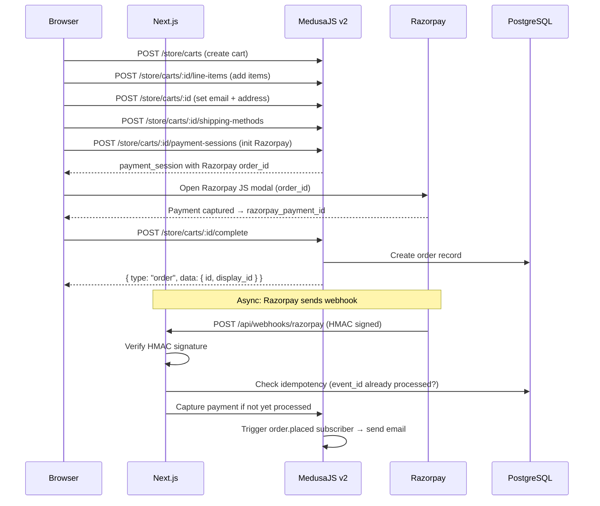
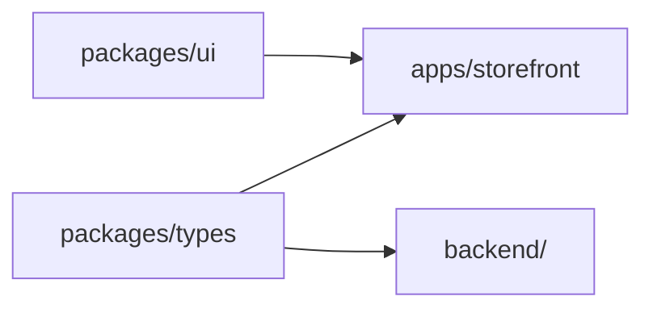

# 04 — System Architecture
## Shree Furniture | E-Commerce Platform

> **Version:** 1.0 | **Status:** Active
> This document was converted from diagram format to text + Mermaid for AI readability.

---

## 1. Architecture Philosophy

**Headless Commerce.** The storefront has zero direct database access. It knows nothing about PostgreSQL, Redis, or internal Medusa data models. All data flows through the MedusaJS REST API only. This means:
- The frontend and backend can be deployed, scaled, and failed independently.
- The storefront can be replaced entirely without touching business logic.
- API contracts (doc 06) are the binding interface between the two.

---

## 2. High-Level System Diagram



---

## 3. Data Flow: Product Page Request

This is the most common request type and illustrates ISR caching:



**Key rules:**
- PDP, PLP, and Homepage all use `revalidate = 60` (60-second ISR).
- On product publish/update via Medusa Admin, an Algolia sync subscriber calls the storefront's `/api/revalidate` endpoint to force **immediate** cache invalidation.
- Search results (`/search`) are CSR — no ISR. Algolia handles freshness.
- Cart and checkout pages are CSR — no ISR.

---

## 4. Data Flow: Checkout & Payment



**Key rules:**
- `unit_price` on each line item is a **snapshot** taken at the moment the item is added.
- Webhook handler at `/api/webhooks/razorpay/route.ts` must be idempotent.
- Cart `complete()` is the single trigger for order creation — never create orders directly.

---

## 5. Rendering Strategy by Page

| Page | Strategy | Rationale |
|---|---|---|
| Homepage (`/`) | ISR — `revalidate: 60` | SEO-critical; content changes infrequently |
| PLP (`/collections/[handle]`) | ISR — `revalidate: 60` | SEO-critical; catalogue updates via admin, not real-time |
| PDP (`/products/[handle]`) | ISR — `revalidate: 60` | SEO most important here; stock changes tolerated at 60s lag |
| Search (`/search`) | CSR (Algolia InstantSearch) | Needs real-time results; not crawled by SEO |
| Cart (`/cart`) | CSR | User-specific, not cacheable |
| Checkout (`/checkout/*`) | CSR | Authenticated + user-specific |
| Order Confirm (`/order/confirm/[id]`) | SSR | Fresh per-request; shows live order status |
| Account pages (`/account/*`) | CSR | Authenticated; all user-specific data |

---

## 6. Monorepo Build Dependency Graph



**Build order enforced by Turborepo:** `packages/types` and `packages/ui` must build before `apps/storefront` and `backend/`.

---

## 7. Infrastructure: Phase 1 (MVP) vs Phase 2

| Layer | Phase 1 (MVP) | Phase 2 |
|---|---|---|
| Storefront hosting | Vercel (free/pro) | Vercel (stays) |
| Backend hosting | Railway.app | Hetzner VPS (Docker) |
| Database | Neon.tech (serverless PG) | Hetzner VPS (PostgreSQL container) |
| Redis | Upstash (serverless) | Hetzner VPS (Redis container) |
| Search | Algolia (free tier) | MeiliSearch (self-hosted on VPS) |
| Nginx | N/A | Reverse proxy on VPS |

---

## 8. Security Boundaries

```
PUBLIC (no auth required):
  GET  /store/products
  GET  /store/products/:handle
  GET  /store/collections
  POST /store/carts
  POST /store/carts/:id/line-items
  GET  /store/regions
  GET  /store/shipping-options

AUTHENTICATED (customer session cookie required):
  GET  /store/customers/me
  POST /store/customers/me/addresses
  GET  /store/orders

ADMIN (Medusa Admin JWT required — different auth):
  All  /admin/*

WEBHOOK (HMAC signature required — no user auth):
  POST /api/webhooks/razorpay
```

---

## 9. Environment Variable Matrix

| Variable | Used By | Public? | Notes |
|---|---|---|---|
| `DATABASE_URL` | Backend only | ❌ No | PostgreSQL connection string |
| `REDIS_URL` | Backend only | ❌ No | Redis connection string |
| `JWT_SECRET` | Backend only | ❌ No | MedusaJS JWT signing |
| `COOKIE_SECRET` | Backend only | ❌ No | MedusaJS cookie signing |
| `RAZORPAY_SECRET` | Backend only | ❌ No | Razorpay API secret |
| `RAZORPAY_WEBHOOK_SECRET` | Storefront webhook handler | ❌ No | HMAC verification |
| `CLOUDINARY_API_SECRET` | Backend only | ❌ No | |
| `ALGOLIA_WRITE_API_KEY` | Backend (sync) | ❌ No | Write-access key |
| `RESEND_API_KEY` | Backend only | ❌ No | |
| `REVALIDATION_SECRET` | Storefront server | ❌ No | ISR on-demand revalidation |
| `NEXT_PUBLIC_MEDUSA_BACKEND_URL` | Storefront | ✅ Yes | Backend API URL |
| `NEXT_PUBLIC_RAZORPAY_KEY_ID` | Storefront (Razorpay modal) | ✅ Yes | Confirmed public by Razorpay docs |
| `NEXT_PUBLIC_ALGOLIA_APP_ID` | Storefront (search) | ✅ Yes | |
| `NEXT_PUBLIC_ALGOLIA_SEARCH_KEY` | Storefront (search) | ✅ Yes | Read-only search key only |
| `NEXT_PUBLIC_POSTHOG_KEY` | Storefront (analytics) | ✅ Yes | |
| `NEXT_PUBLIC_SENTRY_DSN` | Storefront (errors) | ✅ Yes | |

---

*Shree Furniture | v1.1 — Q1 2026 | Converted from binary diagram to Mermaid*
